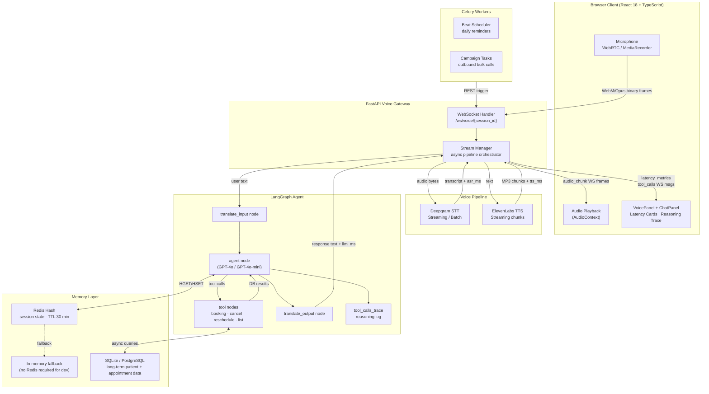

# Real-Time Multilingual Voice AI Clinical Appointment Agent

A production-grade full-stack application enabling patients to book, reschedule, and cancel clinical appointments through real-time voice or text interaction in 15+ languages.

## Architecture Diagram



## Latency Targets & Measurement

| Stage | Target | Measured at |
|-------|--------|-------------|
| ASR   | < 150 ms | Deepgram `SpeechStarted` → final transcript callback |
| LLM   | < 200 ms | Graph invocation start → first token / final response string |
| TTS   | < 100 ms | `synthesize()` call → first audio chunk received |
| **Total** | **< 450 ms** | `audio_end` received → first `audio_chunk` sent to client |

After each turn the server emits:
```jsonc
{ "type": "latency_metrics", "asr_ms": 130, "llm_ms": 175, "tts_ms": 82, "total_ms": 387 }
```
The frontend renders all four values with colour-coded thresholds (green / amber / red) in the VoicePanel latency cards.

## Supported Languages

Hindi, Tamil, Telugu, Kannada, Malayalam, Marathi, Bengali, Gujarati, Punjabi, Odia, English, Spanish, French, German, Arabic, Chinese.

## Tech Stack

| Layer | Technology |
|-------|-----------|
| Backend | FastAPI 0.111, Python 3.12 |
| AI Agent | LangGraph 0.1, LangChain 0.2, OpenAI GPT-4o |
| STT | Deepgram SDK 3.4 (live + batch) |
| TTS | ElevenLabs 1.2 (streaming) |
| Translation | deep-translator (Google backend) |
| Database | SQLAlchemy 2.0 async + aiosqlite / asyncpg |
| Session Cache | Redis 7 (Hash storage, 30-min TTL) |
| Task Queue | Celery 5.4 + Redis broker |
| Frontend | React 18, TypeScript 5, Vite 5, Zustand 4 |
| Container | Docker + nginx |

## Project Structure

```
voice-ai-clinic-agent/
├── backend/
│   ├── agent/          # LangGraph state, nodes, graph
│   ├── database/       # ORM models, CRUD, connection
│   ├── memory/         # Redis session + long-term patient memory
│   ├── scheduling/     # Slot-finding engine
│   ├── services/       # Language detection, translation
│   ├── tools/          # LangChain tools (appointments, doctors)
│   ├── utils/          # Logging, latency tracker
│   ├── voice_gateway/  # WebSocket handler + stream manager
│   ├── voice_pipeline/ # Deepgram STT + ElevenLabs TTS
│   └── main.py         # FastAPI app entry point
├── workers/
│   ├── celery_app.py
│   ├── campaign_scheduler.py
│   └── reminder_worker.py
├── scripts/
│   └── seed_database.py
├── frontend/
│   └── src/
│       ├── components/ # VoicePanel, ChatPanel, AppointmentStatus, LanguageIndicator
│       ├── hooks/      # useVoiceAgent, useWebSocket
│       ├── services/   # REST API client
│       ├── store/      # Zustand global state
│       └── types/      # TypeScript interfaces
├── docker/
│   ├── Dockerfile.backend
│   ├── Dockerfile.frontend
│   └── nginx.conf
├── docker-compose.yml
├── requirements.txt
└── .env.example
```

## Local Setup

### Prerequisites

- Python 3.12+
- Node.js 20+
- Redis (local or Docker)
- API keys: OpenAI, Deepgram, ElevenLabs

### 1. Clone and configure

```bash
cp .env.example .env
# Edit .env with your API keys
```

### 2. Backend

```bash
python -m venv .venv
source .venv/bin/activate        # Windows: .venv\Scripts\activate
pip install -r requirements.txt

# Seed demo data
python -m scripts.seed_database

# Start API server
uvicorn backend.main:app --reload --port 8000
```

### 3. Celery worker (optional — for reminders)

```bash
celery -A workers.celery_app worker --loglevel=info
celery -A workers.celery_app beat --loglevel=info
```

### 4. Frontend

```bash
cd frontend
npm install
npm run dev          # Vite dev server on :5173 with proxy to :8000
```

Open http://localhost:5173

## Docker Deployment

```bash
# Build and start all services
docker compose up --build

# Seed demo data into the running backend
docker compose exec backend python -m scripts.seed_database
```

The application is available at http://localhost (port 80).

## Environment Variables

| Variable | Description | Required |
|----------|-------------|----------|
| `OPENAI_API_KEY` | OpenAI API key | Yes |
| `OPENAI_MODEL` | Model name (default: gpt-4o-mini) | No |
| `DEEPGRAM_API_KEY` | Deepgram API key | Yes |
| `ELEVENLABS_API_KEY` | ElevenLabs API key | Yes |
| `ELEVENLABS_VOICE_ID` | Default English voice ID | Yes |
| `ELEVENLABS_VOICE_ID_HI` | Voice ID for Hindi | No |
| `ELEVENLABS_VOICE_ID_TA` | Voice ID for Tamil | No |
| `ELEVENLABS_VOICE_ID_TE` | Voice ID for Telugu | No |
| `ELEVENLABS_VOICE_ID_KN` | Voice ID for Kannada | No |
| `ELEVENLABS_VOICE_ID_ML` | Voice ID for Malayalam | No |
| `ELEVENLABS_VOICE_ID_MR` | Voice ID for Marathi | No |
| `ELEVENLABS_VOICE_ID_BN` | Voice ID for Bengali | No |
| `REDIS_URL` | Redis connection URL | Yes |
| `DATABASE_URL` | SQLAlchemy async URL | No (defaults to SQLite) |
| `ENABLE_VOICE` | Enable voice pipeline (default: true) | No |
| `ENABLE_TRANSLATION` | Enable translation (default: true) | No |
| `LOG_LEVEL` | debug / info / warning (default: info) | No |

When a per-language voice ID is not set, the TTS module falls back to `ELEVENLABS_VOICE_ID`.

## WebSocket Protocol

Connect to `ws://<host>/ws/voice/<session_id>` for voice or `/ws/text/<session_id>` for text-only.

### Client → Server messages

```jsonc
// Initialise session
{ "type": "init", "patient_name": "Alice" }

// Start live audio stream
{ "type": "audio_start" }

// Binary frames: raw audio chunks (WebM/Opus)

// Send buffered audio for batch transcription
{ "type": "audio_end", "audio": "<base64>" }

// Text fallback
{ "type": "text_message", "text": "Book an appointment" }

// Interrupt TTS playback (barge-in)
{ "type": "interrupt" }
```

### Server → Client messages

```jsonc
{ "type": "session_ready", "message": "..." }
{ "type": "transcript", "text": "...", "is_final": true }
{ "type": "language_detected", "code": "hi", "name": "Hindi" }
{ "type": "agent_text", "text": "...", "is_final": true }
{ "type": "audio_chunk", "data": "<base64 mp3>" }
{ "type": "audio_end" }
{ "type": "latency_metrics", "asr_ms": 130, "llm_ms": 175, "tts_ms": 82, "total_ms": 387 }
{ "type": "tool_calls", "calls": [{ "tool": "book_appointment", "args": { "doctor_id": 3, "slot_id": 12 }, "id": "call_xyz" }] }
{ "type": "error", "message": "..." }
```

`tool_calls` is sent once per turn when the agent invokes one or more tools. The frontend renders this as a collapsible "Agent Reasoning" panel in the VoicePanel, giving evaluators full visibility into the agent's decision trace.

## Campaign Mode

The campaign API allows triggering bulk outbound appointment-reminder calls.

### Endpoints

```
POST  /api/campaigns          Create a campaign
GET   /api/campaigns          List recent campaigns (last 50)
POST  /api/campaigns/{id}/trigger   Dispatch campaign to Celery workers
```

### Create a campaign

```jsonc
// POST /api/campaigns
{
  "name": "Weekly Reminder Run",
  "patient_ids": [101, 102, 103]   // omit to target all scheduled appointments
}

// 201 Created
{ "campaign_id": "camp_20240115_143022", "name": "...", "patient_count": 3, "status": "created" }
```

### Trigger a campaign

```
POST /api/campaigns/camp_20240115_143022/trigger

// 200 OK (Celery available)
{ "status": "dispatched", "task_id": "abc123..." }

// 503 Service Unavailable (no Celery worker running)
{ "status": "celery_unavailable", "message": "Start a worker: celery -A workers.celery_app worker" }
```

Campaign tasks are implemented in `workers/campaign_scheduler.py`. In development the task logs simulated calls; connect a real telephony provider (Twilio, Plivo) by replacing the stub in `run_campaign`.

## Memory Design

The system uses a two-tier memory architecture:

### Short-term: Redis Hash (session memory)

Each voice session gets its own Redis Hash key `session:{session_id}` with a 30-minute sliding TTL. Fields stored: `patient_id`, `patient_name`, `detected_language`, `current_intent`, `turn_count`, and a JSON-encoded `conversation_history` list.

**Rationale**: Hash storage allows O(1) field-level updates — updating only `current_intent` does not require deserialising and re-serialising the full session object. The 30-minute TTL automatically expires abandoned sessions without a cleanup job.

**Fallback**: When Redis is unavailable (dev environment, no `REDIS_URL`), an in-process `dict`-based store provides identical semantics without TTL enforcement.

### Long-term: SQLAlchemy ORM (patient + appointment data)

Patient profiles, appointment records, doctor schedules, and slot availability are persisted in the relational database. Async SQLAlchemy with `aiosqlite` (SQLite) or `asyncpg` (PostgreSQL) ensures non-blocking I/O in the FastAPI async context.

**Rationale**: Separating session state (ephemeral, high-frequency writes) from appointment data (durable, transactional) prevents session operations from contending with appointment CRUD. The relational model enforces referential integrity and enables the atomic slot-booking pattern.

## Design Decisions

**LangGraph over plain function chains** — The `StateGraph` gives explicit barge-in checkpoints and makes the tool-call loop easy to inspect and extend without rewriting routing logic. The `tool_calls_trace` field in `AgentState` accumulates across multi-step loops so the full chain-of-thought is visible to the client.

**In-process translation cache** — Avoids repeated API calls for identical phrases across a session. MD5-keyed dict with 2048-entry cap keeps memory bounded.

**Redis Hash per session** — Enables O(1) field-level updates (e.g., updating only `current_intent`) without serialising the entire session object.

**Atomic slot booking** — `UPDATE slots SET is_available=false WHERE id=? AND is_available=true` prevents double-booking at the database level even under concurrent requests.

**Celery beat for reminders** — Decoupled from the request path; failures in reminder dispatch do not affect the live voice session.

**Per-language ElevenLabs voice IDs** — Each supported language can be assigned its own native-speaker voice via `ELEVENLABS_VOICE_ID_{LANG_CODE}` environment variables, falling back to the default voice. This enables authentic-sounding responses in Hindi, Tamil, Telugu, etc. without code changes.

**Latency measurement end-to-end** — `asr_ms` is captured at the Deepgram callback, `llm_ms` spans graph invocation, and `tts_ms` is the time to first audio chunk. All three are threaded through the async pipeline and emitted as a single `latency_metrics` WebSocket message so the UI can display real numbers rather than estimates.

## Tradeoffs

| Decision | Chosen | Alternative | Why |
|----------|--------|-------------|-----|
| Database | SQLite (dev) | PostgreSQL | SQLite with `StaticPool` works zero-config; switch via `DATABASE_URL` |
| Translation | Google (deep-translator) | LibreTranslate | Better quality; requires internet access |
| TTS format | MP3 streaming chunks | PCM/WAV | ElevenLabs native; browser AudioContext adds ~30–50 ms decode |
| Language detection | `langdetect` | fastText | Zero-dependency; unreliable for short (<5 word) Indic utterances |
| Session store | Redis Hash | Redis JSON / memcached | Field-level O(1) updates; easy TTL management |
| Agent framework | LangGraph | LangChain LCEL | Explicit state graph; testable nodes; barge-in checkpoints |

## Known Limitations

- **SQLite concurrency**: SQLite is used by default; switch to PostgreSQL via `DATABASE_URL` for production concurrency. `StaticPool` forces single-connection mode to avoid `database is locked` errors.
- **Translation quality**: Translation quality depends on Google Translate availability; consider a self-hosted LibreTranslate instance for air-gapped deployments.
- **TTS decode latency**: ElevenLabs streaming returns MP3 chunks; browser AudioContext decode latency adds ~30–50 ms on top of the TTS target.
- **Deepgram jitter**: Deepgram live sessions require a stable WebSocket to their cloud; network jitter will increase ASR latency.
- **Language detection accuracy**: `langdetect` is unreliable for short utterances (< 5 words) in Indic scripts; the system falls back to the previously detected language when confidence is low.
- **Campaign telephony**: The campaign mode dispatches Celery tasks that currently log simulated calls. Integrating real outbound telephony (Twilio, Plivo) requires replacing the stub in `workers/campaign_scheduler.py` and adding telephony credentials to `.env`.
- **Redis TTL in dev**: The in-memory session fallback has no TTL enforcement; long-running dev sessions accumulate state indefinitely. Run a local Redis instance for production-like behaviour.
